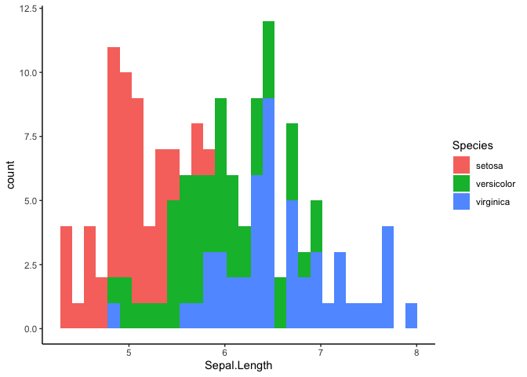

A brief introduction to tidy evaluation
================

``` r
library(tidyverse)
theme_set(theme_classic())
```

## Tidy Eval: What & Why?

First, let’s talk about variables. There are two kinds of variables we
need to know about.

**`env-variables`** are variables that exist in our environment. They’re
what you typically think of when you think of the word variable. In R,
you create them with the assignment operator (`<-`):

``` r
name <- "Kelly"
numbers <- 1:3
ls()
```

    ## [1] "name"    "numbers"

Besides variables that you create, some packages include datasets that
are also available as `env-variables`. `iris` is a dataframe that’s
included in base R.

``` r
head(iris)
```

    ##   Sepal.Length Sepal.Width Petal.Length Petal.Width Species
    ## 1          5.1         3.5          1.4         0.2  setosa
    ## 2          4.9         3.0          1.4         0.2  setosa
    ## 3          4.7         3.2          1.3         0.2  setosa
    ## 4          4.6         3.1          1.5         0.2  setosa
    ## 5          5.0         3.6          1.4         0.2  setosa
    ## 6          5.4         3.9          1.7         0.4  setosa

**`data-variables`** are columns of dataframes. They aren’t in our
environment – they live in their dataframes.

For example, `Species` is a `data-variable` in `iris`. The following
code doesn’t work:

``` r
print(Species)
```

    ## Error in print(Species): object 'Species' not found

In **base R**, we have to tell R which `env-variables` to access
`data-variables` from using `$`:

``` r
iris[iris$Species == "setosa" & iris$Sepal.Length > 5.5, ]
```

    ##    Sepal.Length Sepal.Width Petal.Length Petal.Width Species
    ## 15          5.8         4.0          1.2         0.2  setosa
    ## 16          5.7         4.4          1.5         0.4  setosa
    ## 19          5.7         3.8          1.7         0.3  setosa

The **tidyverse** way allows us to avoid repeating the name of the
dataframe:

``` r
iris %>% filter(Species == "setosa", Sepal.Length > 5.5)
```

    ##   Sepal.Length Sepal.Width Petal.Length Petal.Width Species
    ## 1          5.8         4.0          1.2         0.2  setosa
    ## 2          5.7         4.4          1.5         0.4  setosa
    ## 3          5.7         3.8          1.7         0.3  setosa

There’s some magic going on under the hood of dplyr’s `filter` function
that lets us use `Species` and `Sepal.Length`, which are
`data-variables`, as if they were `env-variables`. Normally, R would
complain that it can’t find `Species`.

**Tidy evaluation** is used in many tidyverse functions to **delay
evaluating the variables until later on inside the function code**. This
makes it slightly harder to use tidyverse functions inside our own
functions, but it’s worth learning to write more reusable code\!

### Example: dplyr functions

Let’s say you’re summarizing your data:

``` r
iris %>%
    group_by(Species) %>%
    summarize(
        n = n(),
        min = min(Sepal.Length),
        max = max(Sepal.Length)
    )
```

    ## # A tibble: 3 x 4
    ##   Species        n   min   max
    ##   <fct>      <int> <dbl> <dbl>
    ## 1 setosa        50   4.3   5.8
    ## 2 versicolor    50   4.9   7  
    ## 3 virginica     50   4.9   7.9

And you realize you’d like to also summarize the `Sepal.Width` column.
You could copy-paste your code and change both instances of
`Sepal.Length` to `Sepal.Width`:

``` r
iris %>%
    group_by(Species) %>%
    summarize(
        n = n(),
        min = min(Sepal.Width),
        max = max(Sepal.Width)
    )
```

    ## # A tibble: 3 x 4
    ##   Species        n   min   max
    ##   <fct>      <int> <dbl> <dbl>
    ## 1 setosa        50   2.3   4.4
    ## 2 versicolor    50   2     3.4
    ## 3 virginica     50   2.2   3.8

But now you have repetitive code. If you later decide you want to also
calculate the mean of those columns, you’ll have to modify your code in
two places – or more if you kept on copy-pasting for more columns.

Instead, let’s try writing a function that will summarize any column
name we want.

``` r
var_summary <- function(data, var) {
    data  %>%
        group_by(Species) %>%
        summarize(n = n(),
                  min = min(var),
                  max = max(var))
}
iris %>%
    var_summary(Sepal.Length)
```

    ## Error: object 'Sepal.Length' not found

That didn’t quite work because `Sepal.Length` is a `data-variable` that
doesn’t exist in our environment, so R can’t find it.  
We need to tell R to wait to evaluate the `var` argument until it gets
to the `summarize` function.

We can do that by capturing the variable with the `enquo` function to
create a `quosure` (`quoted closure`). A `quosure` captures a variable
or expression so we can evaluate it later. Think of it like freezing in
place. Using a special operator `!!` (pronounced `bang-bang`), we’ll
tell R to wait to evaluate our quosure until it’s inside the `summarize`
function.

``` r
var_summary <- function(data, var) {
    var <- enquo(var)
    data  %>%
        group_by(Species) %>%
        summarize(n = n(),
                  min = min(!!var),
                  max = max(!!var))
}
iris %>%
    var_summary(Sepal.Length)
```

    ## # A tibble: 3 x 4
    ##   Species        n   min   max
    ##   <fct>      <int> <dbl> <dbl>
    ## 1 setosa        50   4.3   5.8
    ## 2 versicolor    50   4.9   7  
    ## 3 virginica     50   4.9   7.9

This pattern of using `enquo` followed soon after by `!!` is really
common, so the tidyverse developers created a new operator called
embracing `{{ }}` to do them both at the same time:

``` r
var_summary <- function(data, var) {
  data %>% 
    group_by(Species) %>%
    summarize(n = n(), 
              min = min({{ var }}), 
              max = max({{ var }})
              )
}
```

Most of the time, embracing is what you’ll want to use.

### Example: expressions

You can also pass more complicated expressions as arguments to
functions.

``` r
filter2 <- function(data, comparison1, comparison2) {
    data %>% 
        filter({{ comparison1 }}, {{ comparison2 }})
}
iris %>% filter2(Sepal.Length > Sepal.Width * 2.5, Species == "versicolor")
```

    ##   Sepal.Length Sepal.Width Petal.Length Petal.Width    Species
    ## 1          6.0         2.2          4.0         1.0 versicolor
    ## 2          6.2         2.2          4.5         1.5 versicolor
    ## 3          6.3         2.5          4.9         1.5 versicolor
    ## 4          6.3         2.3          4.4         1.3 versicolor

### Example: multiple arguments

You can pass any number of arguments to other functions with `...`.

``` r
summarize_vars <- function(data, ...) {
  data %>% 
    group_by(Species) %>%
    summarize_at(vars(...), mean)
}
iris %>% summarize_vars(Sepal.Length, Sepal.Width)
```

    ## # A tibble: 3 x 3
    ##   Species    Sepal.Length Sepal.Width
    ##   <fct>             <dbl>       <dbl>
    ## 1 setosa             5.01        3.43
    ## 2 versicolor         5.94        2.77
    ## 3 virginica          6.59        2.97

You don’t need to use `!!enquo` or `{{ }}` when using `...`. Note that
`...` has to be the last argument in the function signature.

## Exercises

### 1\. Write a function to calculate the ratio of any two numeric variables

``` r
# replace the X's to make this code work
calc_ratio <- function(data, var1, var2) {
    XXXXXX %>% 
        mutate(ratio = XXXXXXX / XXXXXXX)
}
# example:
#iris %>% calc_ratio(Sepal.Length, Sepal.Width)
#iris %>% calc_ratio(Petal.Width, Petal.Length)
```

### 2\. Write a function to create a histogram that can use any column for `x`

Here’s an example histogram where `x` is `Sepal.Length`:

``` r
iris %>% 
    ggplot(aes(x = Sepal.Length, fill = Species)) +
    geom_histogram()
```

    ## `stat_bin()` using `bins = 30`. Pick better value with `binwidth`.

<!-- -->

Create a function that takes a column to use for `x`:

``` r
plot_hist <- function(data, x_col) {
    # write code here
}
plot_hist(iris, Sepal.Width)
```

    ## NULL

``` r
plot_hist(iris, Petal.Length)
```

    ## NULL

### 3\. Write a function to create a boxplot with any aesthetics

``` r
# write function here

# example:
#iris %>% plot_box(x = Species, y = Petal.Width, fill = Species)
#iris %>% plot_box(x = Species, y = Sepal.Length, color = Species)
```

### 4\. Bonus: Write a function that names a new column based on the variable

How strong is your Google-foo?

``` r
calc_mean <- function(data, var) {
    data %>% 
        summarize(XXXXXXXXX= mean({{ var }}))
}
# example:
#iris %>% calc_mean(Sepal.Length)
#>   mean_Sepal.Length
#> 1          5.843333
```

## Resources

  - Vignette on tidy eval with dplyr:
    <https://dplyr.tidyverse.org/dev/articles/programming.html>
  - Section on tidy eval in The Tidynomicon:
    <http://tidynomicon.tech/nse.html#what-is-tidy-evaluation>
  - Tidy Eval book (in progress): <https://tidyeval.tidyverse.org/>
  - Metaprogramming chapters of Advanced R:
    <https://adv-r.hadley.nz/metaprogramming.html>
