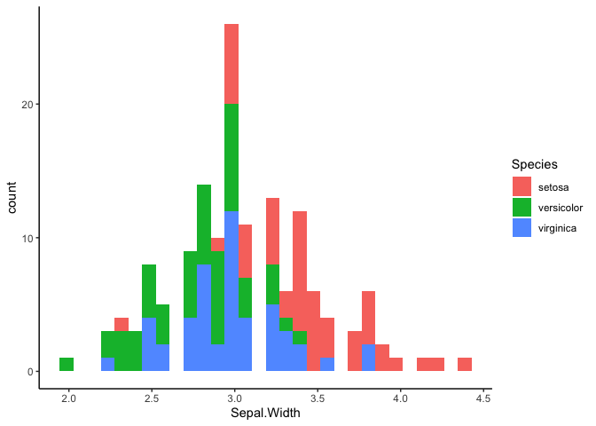

A brief introduction to tidy evaluation
================

``` r
library(tidyverse)
theme_set(theme_classic())
```

## Tidy Eval: What & Why?

First, let’s talk about variables. There are two kinds of variables we
need to know about.

**`env-variables`** are variables that exist in our environment. They’re
what you typically think of when you think of the word variable. In R,
you create them with the assignment operator (`<-`):

``` r
name <- "Kelly"
numbers <- 1:3
ls()
```

    ## [1] "calc_mean"      "calc_ratio"     "filter2"        "name"           "numbers"       
    ## [6] "plot_box"       "plot_hist"      "summarize_vars" "var_summary"

Besides variables that you create, some packages include datasets that
are also available as `env-variables`. `iris` is a dataframe that’s
included in base R.

``` r
head(iris)
```

    ##   Sepal.Length Sepal.Width Petal.Length Petal.Width Species
    ## 1          5.1         3.5          1.4         0.2  setosa
    ## 2          4.9         3.0          1.4         0.2  setosa
    ## 3          4.7         3.2          1.3         0.2  setosa
    ## 4          4.6         3.1          1.5         0.2  setosa
    ## 5          5.0         3.6          1.4         0.2  setosa
    ## 6          5.4         3.9          1.7         0.4  setosa

**`data-variables`** are columns of dataframes. They aren’t in our
environment – they live in their dataframes.

For example, `Species` is a `data-variable` in `iris`. The following
code doesn’t work:

``` r
print(Species)
```

    ## Error in print(Species): object 'Species' not found

In **base R**, we have to tell R which `env-variables` to access
`data-variables` from using `$`:

``` r
iris[iris$Species == "setosa" & iris$Sepal.Length > 5.5, ]
```

    ##    Sepal.Length Sepal.Width Petal.Length Petal.Width Species
    ## 15          5.8         4.0          1.2         0.2  setosa
    ## 16          5.7         4.4          1.5         0.4  setosa
    ## 19          5.7         3.8          1.7         0.3  setosa

The **tidyverse** way allows us to avoid repeating the name of the
dataframe:

``` r
iris %>% filter(Species == "setosa", Sepal.Length > 5.5)
```

    ##   Sepal.Length Sepal.Width Petal.Length Petal.Width Species
    ## 1          5.8         4.0          1.2         0.2  setosa
    ## 2          5.7         4.4          1.5         0.4  setosa
    ## 3          5.7         3.8          1.7         0.3  setosa

There’s some magic going on under the hood of dplyr’s `filter` function
that lets us use `Species` and `Sepal.Length`, which are
`data-variables`, as if they were `env-variables`. Normally, R would
complain that it can’t find `Species`.

**Tidy evaluation** is used in many tidyverse functions to **delay
evaluating the variables until later on inside the function code**. This
makes it slightly harder to use tidyverse functions inside our own
functions, but it’s worth learning to write more reusable code\!

### Example: dplyr functions

Let’s say you’re summarizing your data:

``` r
iris %>%
    group_by(Species) %>%
    summarize(
        n = n(),
        min = min(Sepal.Length),
        max = max(Sepal.Length)
    )
```

    ## # A tibble: 3 x 4
    ##   Species        n   min   max
    ##   <fct>      <int> <dbl> <dbl>
    ## 1 setosa        50   4.3   5.8
    ## 2 versicolor    50   4.9   7  
    ## 3 virginica     50   4.9   7.9

And you realize you’d like to also summarize the `Sepal.Width` column.
You could copy-paste your code and change both instances of
`Sepal.Length` to `Sepal.Width`:

``` r
iris %>%
    group_by(Species) %>%
    summarize(
        n = n(),
        min = min(Sepal.Width),
        max = max(Sepal.Width)
    )
```

    ## # A tibble: 3 x 4
    ##   Species        n   min   max
    ##   <fct>      <int> <dbl> <dbl>
    ## 1 setosa        50   2.3   4.4
    ## 2 versicolor    50   2     3.4
    ## 3 virginica     50   2.2   3.8

But now you have repetitive code. If you later decide you want to also
calculate the mean of those columns, you’ll have to modify your code in
two places – or more if you kept on copy-pasting for more columns.

Instead, let’s try writing a function that will summarize any column
name we want.

``` r
var_summary <- function(data, var) {
    data  %>%
        group_by(Species) %>%
        summarize(n = n(),
                  min = min(var),
                  max = max(var))
}
iris %>%
    var_summary(Sepal.Length)
```

    ## Error: object 'Sepal.Length' not found

That didn’t quite work because `Sepal.Length` is a `data-variable` that
doesn’t exist in our environment, so R can’t find it.  
We need to tell R to wait to evaluate the `var` argument until it gets
to the `summarize` function.

We can do that by capturing the variable with the `enquo` function to
create a `quosure` (`quoted closure`). A `quosure` captures a variable
or expression so we can evaluate it later. Think of it like freezing in
place. Using a special operator `!!` (pronounced `bang-bang`), we’ll
tell R to wait to evaluate our quosure until it’s inside the `summarize`
function.

``` r
var_summary <- function(data, var) {
    var <- enquo(var)
    data  %>%
        group_by(Species) %>%
        summarize(n = n(),
                  min = min(!!var),
                  max = max(!!var))
}
iris %>%
    var_summary(Sepal.Length)
```

    ## # A tibble: 3 x 4
    ##   Species        n   min   max
    ##   <fct>      <int> <dbl> <dbl>
    ## 1 setosa        50   4.3   5.8
    ## 2 versicolor    50   4.9   7  
    ## 3 virginica     50   4.9   7.9

This pattern of using `enquo` followed soon after by `!!` is really
common, so the tidyverse developers created a new operator called
embracing `{{ }}` to do them both at the same time:

``` r
var_summary <- function(data, var) {
  data %>% 
    group_by(Species) %>%
    summarize(n = n(), 
              min = min({{ var }}), 
              max = max({{ var }})
              )
}
```

Most of the time, embracing is what you’ll want to use.

### Example: expressions

You can also pass more complicated expressions as arguments to
functions.

``` r
filter2 <- function(data, comparison1, comparison2) {
    data %>% 
        filter({{ comparison1 }}, {{ comparison2 }})
}
iris %>% filter2(Sepal.Length > Sepal.Width * 2.5, Species == "versicolor")
```

    ##   Sepal.Length Sepal.Width Petal.Length Petal.Width    Species
    ## 1          6.0         2.2          4.0         1.0 versicolor
    ## 2          6.2         2.2          4.5         1.5 versicolor
    ## 3          6.3         2.5          4.9         1.5 versicolor
    ## 4          6.3         2.3          4.4         1.3 versicolor

### Example: multiple arguments

You can pass any number of arguments to other functions with `...`.

``` r
summarize_vars <- function(data, ...) {
  data %>% 
    group_by(Species) %>%
    summarize_at(vars(...), mean)
}
iris %>% summarize_vars(Sepal.Length, Sepal.Width)
```

    ## # A tibble: 3 x 3
    ##   Species    Sepal.Length Sepal.Width
    ##   <fct>             <dbl>       <dbl>
    ## 1 setosa             5.01        3.43
    ## 2 versicolor         5.94        2.77
    ## 3 virginica          6.59        2.97

You don’t need to use `!!enquo` or `{{ }}` when using `...`. Note that
`...` has to be the last argument in the function signature.

## Exercises

### 1\. Write a function to calculate the ratio of any two numeric variables

``` r
# replace the X's to make this code work
calc_ratio <- function(data, var1, var2) {
    data %>% 
        mutate(ratio = {{ var1 }} / {{ var2 }})
}
# example:
iris %>% calc_ratio(Sepal.Length, Sepal.Width)
```

    ##     Sepal.Length Sepal.Width Petal.Length Petal.Width    Species    ratio
    ## 1            5.1         3.5          1.4         0.2     setosa 1.457143
    ## 2            4.9         3.0          1.4         0.2     setosa 1.633333
    ## 3            4.7         3.2          1.3         0.2     setosa 1.468750
    ## 4            4.6         3.1          1.5         0.2     setosa 1.483871
    ## 5            5.0         3.6          1.4         0.2     setosa 1.388889
    ## 6            5.4         3.9          1.7         0.4     setosa 1.384615
    ## 7            4.6         3.4          1.4         0.3     setosa 1.352941
    ## 8            5.0         3.4          1.5         0.2     setosa 1.470588
    ## 9            4.4         2.9          1.4         0.2     setosa 1.517241
    ## 10           4.9         3.1          1.5         0.1     setosa 1.580645
    ## 11           5.4         3.7          1.5         0.2     setosa 1.459459
    ## 12           4.8         3.4          1.6         0.2     setosa 1.411765
    ## 13           4.8         3.0          1.4         0.1     setosa 1.600000
    ## 14           4.3         3.0          1.1         0.1     setosa 1.433333
    ## 15           5.8         4.0          1.2         0.2     setosa 1.450000
    ## 16           5.7         4.4          1.5         0.4     setosa 1.295455
    ## 17           5.4         3.9          1.3         0.4     setosa 1.384615
    ## 18           5.1         3.5          1.4         0.3     setosa 1.457143
    ## 19           5.7         3.8          1.7         0.3     setosa 1.500000
    ## 20           5.1         3.8          1.5         0.3     setosa 1.342105
    ## 21           5.4         3.4          1.7         0.2     setosa 1.588235
    ## 22           5.1         3.7          1.5         0.4     setosa 1.378378
    ## 23           4.6         3.6          1.0         0.2     setosa 1.277778
    ## 24           5.1         3.3          1.7         0.5     setosa 1.545455
    ## 25           4.8         3.4          1.9         0.2     setosa 1.411765
    ## 26           5.0         3.0          1.6         0.2     setosa 1.666667
    ## 27           5.0         3.4          1.6         0.4     setosa 1.470588
    ## 28           5.2         3.5          1.5         0.2     setosa 1.485714
    ## 29           5.2         3.4          1.4         0.2     setosa 1.529412
    ## 30           4.7         3.2          1.6         0.2     setosa 1.468750
    ## 31           4.8         3.1          1.6         0.2     setosa 1.548387
    ## 32           5.4         3.4          1.5         0.4     setosa 1.588235
    ## 33           5.2         4.1          1.5         0.1     setosa 1.268293
    ## 34           5.5         4.2          1.4         0.2     setosa 1.309524
    ## 35           4.9         3.1          1.5         0.2     setosa 1.580645
    ## 36           5.0         3.2          1.2         0.2     setosa 1.562500
    ## 37           5.5         3.5          1.3         0.2     setosa 1.571429
    ## 38           4.9         3.6          1.4         0.1     setosa 1.361111
    ## 39           4.4         3.0          1.3         0.2     setosa 1.466667
    ## 40           5.1         3.4          1.5         0.2     setosa 1.500000
    ## 41           5.0         3.5          1.3         0.3     setosa 1.428571
    ## 42           4.5         2.3          1.3         0.3     setosa 1.956522
    ## 43           4.4         3.2          1.3         0.2     setosa 1.375000
    ## 44           5.0         3.5          1.6         0.6     setosa 1.428571
    ## 45           5.1         3.8          1.9         0.4     setosa 1.342105
    ## 46           4.8         3.0          1.4         0.3     setosa 1.600000
    ## 47           5.1         3.8          1.6         0.2     setosa 1.342105
    ## 48           4.6         3.2          1.4         0.2     setosa 1.437500
    ## 49           5.3         3.7          1.5         0.2     setosa 1.432432
    ## 50           5.0         3.3          1.4         0.2     setosa 1.515152
    ## 51           7.0         3.2          4.7         1.4 versicolor 2.187500
    ## 52           6.4         3.2          4.5         1.5 versicolor 2.000000
    ## 53           6.9         3.1          4.9         1.5 versicolor 2.225806
    ## 54           5.5         2.3          4.0         1.3 versicolor 2.391304
    ## 55           6.5         2.8          4.6         1.5 versicolor 2.321429
    ## 56           5.7         2.8          4.5         1.3 versicolor 2.035714
    ## 57           6.3         3.3          4.7         1.6 versicolor 1.909091
    ## 58           4.9         2.4          3.3         1.0 versicolor 2.041667
    ## 59           6.6         2.9          4.6         1.3 versicolor 2.275862
    ## 60           5.2         2.7          3.9         1.4 versicolor 1.925926
    ## 61           5.0         2.0          3.5         1.0 versicolor 2.500000
    ## 62           5.9         3.0          4.2         1.5 versicolor 1.966667
    ## 63           6.0         2.2          4.0         1.0 versicolor 2.727273
    ## 64           6.1         2.9          4.7         1.4 versicolor 2.103448
    ## 65           5.6         2.9          3.6         1.3 versicolor 1.931034
    ## 66           6.7         3.1          4.4         1.4 versicolor 2.161290
    ## 67           5.6         3.0          4.5         1.5 versicolor 1.866667
    ## 68           5.8         2.7          4.1         1.0 versicolor 2.148148
    ## 69           6.2         2.2          4.5         1.5 versicolor 2.818182
    ## 70           5.6         2.5          3.9         1.1 versicolor 2.240000
    ## 71           5.9         3.2          4.8         1.8 versicolor 1.843750
    ## 72           6.1         2.8          4.0         1.3 versicolor 2.178571
    ## 73           6.3         2.5          4.9         1.5 versicolor 2.520000
    ## 74           6.1         2.8          4.7         1.2 versicolor 2.178571
    ## 75           6.4         2.9          4.3         1.3 versicolor 2.206897
    ## 76           6.6         3.0          4.4         1.4 versicolor 2.200000
    ## 77           6.8         2.8          4.8         1.4 versicolor 2.428571
    ## 78           6.7         3.0          5.0         1.7 versicolor 2.233333
    ## 79           6.0         2.9          4.5         1.5 versicolor 2.068966
    ## 80           5.7         2.6          3.5         1.0 versicolor 2.192308
    ## 81           5.5         2.4          3.8         1.1 versicolor 2.291667
    ## 82           5.5         2.4          3.7         1.0 versicolor 2.291667
    ## 83           5.8         2.7          3.9         1.2 versicolor 2.148148
    ## 84           6.0         2.7          5.1         1.6 versicolor 2.222222
    ## 85           5.4         3.0          4.5         1.5 versicolor 1.800000
    ## 86           6.0         3.4          4.5         1.6 versicolor 1.764706
    ## 87           6.7         3.1          4.7         1.5 versicolor 2.161290
    ## 88           6.3         2.3          4.4         1.3 versicolor 2.739130
    ## 89           5.6         3.0          4.1         1.3 versicolor 1.866667
    ## 90           5.5         2.5          4.0         1.3 versicolor 2.200000
    ## 91           5.5         2.6          4.4         1.2 versicolor 2.115385
    ## 92           6.1         3.0          4.6         1.4 versicolor 2.033333
    ## 93           5.8         2.6          4.0         1.2 versicolor 2.230769
    ## 94           5.0         2.3          3.3         1.0 versicolor 2.173913
    ## 95           5.6         2.7          4.2         1.3 versicolor 2.074074
    ## 96           5.7         3.0          4.2         1.2 versicolor 1.900000
    ## 97           5.7         2.9          4.2         1.3 versicolor 1.965517
    ## 98           6.2         2.9          4.3         1.3 versicolor 2.137931
    ## 99           5.1         2.5          3.0         1.1 versicolor 2.040000
    ## 100          5.7         2.8          4.1         1.3 versicolor 2.035714
    ## 101          6.3         3.3          6.0         2.5  virginica 1.909091
    ## 102          5.8         2.7          5.1         1.9  virginica 2.148148
    ## 103          7.1         3.0          5.9         2.1  virginica 2.366667
    ## 104          6.3         2.9          5.6         1.8  virginica 2.172414
    ## 105          6.5         3.0          5.8         2.2  virginica 2.166667
    ## 106          7.6         3.0          6.6         2.1  virginica 2.533333
    ## 107          4.9         2.5          4.5         1.7  virginica 1.960000
    ## 108          7.3         2.9          6.3         1.8  virginica 2.517241
    ## 109          6.7         2.5          5.8         1.8  virginica 2.680000
    ## 110          7.2         3.6          6.1         2.5  virginica 2.000000
    ## 111          6.5         3.2          5.1         2.0  virginica 2.031250
    ## 112          6.4         2.7          5.3         1.9  virginica 2.370370
    ## 113          6.8         3.0          5.5         2.1  virginica 2.266667
    ## 114          5.7         2.5          5.0         2.0  virginica 2.280000
    ## 115          5.8         2.8          5.1         2.4  virginica 2.071429
    ## 116          6.4         3.2          5.3         2.3  virginica 2.000000
    ## 117          6.5         3.0          5.5         1.8  virginica 2.166667
    ## 118          7.7         3.8          6.7         2.2  virginica 2.026316
    ## 119          7.7         2.6          6.9         2.3  virginica 2.961538
    ## 120          6.0         2.2          5.0         1.5  virginica 2.727273
    ## 121          6.9         3.2          5.7         2.3  virginica 2.156250
    ## 122          5.6         2.8          4.9         2.0  virginica 2.000000
    ## 123          7.7         2.8          6.7         2.0  virginica 2.750000
    ## 124          6.3         2.7          4.9         1.8  virginica 2.333333
    ## 125          6.7         3.3          5.7         2.1  virginica 2.030303
    ## 126          7.2         3.2          6.0         1.8  virginica 2.250000
    ## 127          6.2         2.8          4.8         1.8  virginica 2.214286
    ## 128          6.1         3.0          4.9         1.8  virginica 2.033333
    ## 129          6.4         2.8          5.6         2.1  virginica 2.285714
    ## 130          7.2         3.0          5.8         1.6  virginica 2.400000
    ## 131          7.4         2.8          6.1         1.9  virginica 2.642857
    ## 132          7.9         3.8          6.4         2.0  virginica 2.078947
    ## 133          6.4         2.8          5.6         2.2  virginica 2.285714
    ## 134          6.3         2.8          5.1         1.5  virginica 2.250000
    ## 135          6.1         2.6          5.6         1.4  virginica 2.346154
    ## 136          7.7         3.0          6.1         2.3  virginica 2.566667
    ## 137          6.3         3.4          5.6         2.4  virginica 1.852941
    ## 138          6.4         3.1          5.5         1.8  virginica 2.064516
    ## 139          6.0         3.0          4.8         1.8  virginica 2.000000
    ## 140          6.9         3.1          5.4         2.1  virginica 2.225806
    ## 141          6.7         3.1          5.6         2.4  virginica 2.161290
    ## 142          6.9         3.1          5.1         2.3  virginica 2.225806
    ## 143          5.8         2.7          5.1         1.9  virginica 2.148148
    ## 144          6.8         3.2          5.9         2.3  virginica 2.125000
    ## 145          6.7         3.3          5.7         2.5  virginica 2.030303
    ## 146          6.7         3.0          5.2         2.3  virginica 2.233333
    ## 147          6.3         2.5          5.0         1.9  virginica 2.520000
    ## 148          6.5         3.0          5.2         2.0  virginica 2.166667
    ## 149          6.2         3.4          5.4         2.3  virginica 1.823529
    ## 150          5.9         3.0          5.1         1.8  virginica 1.966667

``` r
iris %>% calc_ratio(Petal.Width, Petal.Length)
```

    ##     Sepal.Length Sepal.Width Petal.Length Petal.Width    Species      ratio
    ## 1            5.1         3.5          1.4         0.2     setosa 0.14285714
    ## 2            4.9         3.0          1.4         0.2     setosa 0.14285714
    ## 3            4.7         3.2          1.3         0.2     setosa 0.15384615
    ## 4            4.6         3.1          1.5         0.2     setosa 0.13333333
    ## 5            5.0         3.6          1.4         0.2     setosa 0.14285714
    ## 6            5.4         3.9          1.7         0.4     setosa 0.23529412
    ## 7            4.6         3.4          1.4         0.3     setosa 0.21428571
    ## 8            5.0         3.4          1.5         0.2     setosa 0.13333333
    ## 9            4.4         2.9          1.4         0.2     setosa 0.14285714
    ## 10           4.9         3.1          1.5         0.1     setosa 0.06666667
    ## 11           5.4         3.7          1.5         0.2     setosa 0.13333333
    ## 12           4.8         3.4          1.6         0.2     setosa 0.12500000
    ## 13           4.8         3.0          1.4         0.1     setosa 0.07142857
    ## 14           4.3         3.0          1.1         0.1     setosa 0.09090909
    ## 15           5.8         4.0          1.2         0.2     setosa 0.16666667
    ## 16           5.7         4.4          1.5         0.4     setosa 0.26666667
    ## 17           5.4         3.9          1.3         0.4     setosa 0.30769231
    ## 18           5.1         3.5          1.4         0.3     setosa 0.21428571
    ## 19           5.7         3.8          1.7         0.3     setosa 0.17647059
    ## 20           5.1         3.8          1.5         0.3     setosa 0.20000000
    ## 21           5.4         3.4          1.7         0.2     setosa 0.11764706
    ## 22           5.1         3.7          1.5         0.4     setosa 0.26666667
    ## 23           4.6         3.6          1.0         0.2     setosa 0.20000000
    ## 24           5.1         3.3          1.7         0.5     setosa 0.29411765
    ## 25           4.8         3.4          1.9         0.2     setosa 0.10526316
    ## 26           5.0         3.0          1.6         0.2     setosa 0.12500000
    ## 27           5.0         3.4          1.6         0.4     setosa 0.25000000
    ## 28           5.2         3.5          1.5         0.2     setosa 0.13333333
    ## 29           5.2         3.4          1.4         0.2     setosa 0.14285714
    ## 30           4.7         3.2          1.6         0.2     setosa 0.12500000
    ## 31           4.8         3.1          1.6         0.2     setosa 0.12500000
    ## 32           5.4         3.4          1.5         0.4     setosa 0.26666667
    ## 33           5.2         4.1          1.5         0.1     setosa 0.06666667
    ## 34           5.5         4.2          1.4         0.2     setosa 0.14285714
    ## 35           4.9         3.1          1.5         0.2     setosa 0.13333333
    ## 36           5.0         3.2          1.2         0.2     setosa 0.16666667
    ## 37           5.5         3.5          1.3         0.2     setosa 0.15384615
    ## 38           4.9         3.6          1.4         0.1     setosa 0.07142857
    ## 39           4.4         3.0          1.3         0.2     setosa 0.15384615
    ## 40           5.1         3.4          1.5         0.2     setosa 0.13333333
    ## 41           5.0         3.5          1.3         0.3     setosa 0.23076923
    ## 42           4.5         2.3          1.3         0.3     setosa 0.23076923
    ## 43           4.4         3.2          1.3         0.2     setosa 0.15384615
    ## 44           5.0         3.5          1.6         0.6     setosa 0.37500000
    ## 45           5.1         3.8          1.9         0.4     setosa 0.21052632
    ## 46           4.8         3.0          1.4         0.3     setosa 0.21428571
    ## 47           5.1         3.8          1.6         0.2     setosa 0.12500000
    ## 48           4.6         3.2          1.4         0.2     setosa 0.14285714
    ## 49           5.3         3.7          1.5         0.2     setosa 0.13333333
    ## 50           5.0         3.3          1.4         0.2     setosa 0.14285714
    ## 51           7.0         3.2          4.7         1.4 versicolor 0.29787234
    ## 52           6.4         3.2          4.5         1.5 versicolor 0.33333333
    ## 53           6.9         3.1          4.9         1.5 versicolor 0.30612245
    ## 54           5.5         2.3          4.0         1.3 versicolor 0.32500000
    ## 55           6.5         2.8          4.6         1.5 versicolor 0.32608696
    ## 56           5.7         2.8          4.5         1.3 versicolor 0.28888889
    ## 57           6.3         3.3          4.7         1.6 versicolor 0.34042553
    ## 58           4.9         2.4          3.3         1.0 versicolor 0.30303030
    ## 59           6.6         2.9          4.6         1.3 versicolor 0.28260870
    ## 60           5.2         2.7          3.9         1.4 versicolor 0.35897436
    ## 61           5.0         2.0          3.5         1.0 versicolor 0.28571429
    ## 62           5.9         3.0          4.2         1.5 versicolor 0.35714286
    ## 63           6.0         2.2          4.0         1.0 versicolor 0.25000000
    ## 64           6.1         2.9          4.7         1.4 versicolor 0.29787234
    ## 65           5.6         2.9          3.6         1.3 versicolor 0.36111111
    ## 66           6.7         3.1          4.4         1.4 versicolor 0.31818182
    ## 67           5.6         3.0          4.5         1.5 versicolor 0.33333333
    ## 68           5.8         2.7          4.1         1.0 versicolor 0.24390244
    ## 69           6.2         2.2          4.5         1.5 versicolor 0.33333333
    ## 70           5.6         2.5          3.9         1.1 versicolor 0.28205128
    ## 71           5.9         3.2          4.8         1.8 versicolor 0.37500000
    ## 72           6.1         2.8          4.0         1.3 versicolor 0.32500000
    ## 73           6.3         2.5          4.9         1.5 versicolor 0.30612245
    ## 74           6.1         2.8          4.7         1.2 versicolor 0.25531915
    ## 75           6.4         2.9          4.3         1.3 versicolor 0.30232558
    ## 76           6.6         3.0          4.4         1.4 versicolor 0.31818182
    ## 77           6.8         2.8          4.8         1.4 versicolor 0.29166667
    ## 78           6.7         3.0          5.0         1.7 versicolor 0.34000000
    ## 79           6.0         2.9          4.5         1.5 versicolor 0.33333333
    ## 80           5.7         2.6          3.5         1.0 versicolor 0.28571429
    ## 81           5.5         2.4          3.8         1.1 versicolor 0.28947368
    ## 82           5.5         2.4          3.7         1.0 versicolor 0.27027027
    ## 83           5.8         2.7          3.9         1.2 versicolor 0.30769231
    ## 84           6.0         2.7          5.1         1.6 versicolor 0.31372549
    ## 85           5.4         3.0          4.5         1.5 versicolor 0.33333333
    ## 86           6.0         3.4          4.5         1.6 versicolor 0.35555556
    ## 87           6.7         3.1          4.7         1.5 versicolor 0.31914894
    ## 88           6.3         2.3          4.4         1.3 versicolor 0.29545455
    ## 89           5.6         3.0          4.1         1.3 versicolor 0.31707317
    ## 90           5.5         2.5          4.0         1.3 versicolor 0.32500000
    ## 91           5.5         2.6          4.4         1.2 versicolor 0.27272727
    ## 92           6.1         3.0          4.6         1.4 versicolor 0.30434783
    ## 93           5.8         2.6          4.0         1.2 versicolor 0.30000000
    ## 94           5.0         2.3          3.3         1.0 versicolor 0.30303030
    ## 95           5.6         2.7          4.2         1.3 versicolor 0.30952381
    ## 96           5.7         3.0          4.2         1.2 versicolor 0.28571429
    ## 97           5.7         2.9          4.2         1.3 versicolor 0.30952381
    ## 98           6.2         2.9          4.3         1.3 versicolor 0.30232558
    ## 99           5.1         2.5          3.0         1.1 versicolor 0.36666667
    ## 100          5.7         2.8          4.1         1.3 versicolor 0.31707317
    ## 101          6.3         3.3          6.0         2.5  virginica 0.41666667
    ## 102          5.8         2.7          5.1         1.9  virginica 0.37254902
    ## 103          7.1         3.0          5.9         2.1  virginica 0.35593220
    ## 104          6.3         2.9          5.6         1.8  virginica 0.32142857
    ## 105          6.5         3.0          5.8         2.2  virginica 0.37931034
    ## 106          7.6         3.0          6.6         2.1  virginica 0.31818182
    ## 107          4.9         2.5          4.5         1.7  virginica 0.37777778
    ## 108          7.3         2.9          6.3         1.8  virginica 0.28571429
    ## 109          6.7         2.5          5.8         1.8  virginica 0.31034483
    ## 110          7.2         3.6          6.1         2.5  virginica 0.40983607
    ## 111          6.5         3.2          5.1         2.0  virginica 0.39215686
    ## 112          6.4         2.7          5.3         1.9  virginica 0.35849057
    ## 113          6.8         3.0          5.5         2.1  virginica 0.38181818
    ## 114          5.7         2.5          5.0         2.0  virginica 0.40000000
    ## 115          5.8         2.8          5.1         2.4  virginica 0.47058824
    ## 116          6.4         3.2          5.3         2.3  virginica 0.43396226
    ## 117          6.5         3.0          5.5         1.8  virginica 0.32727273
    ## 118          7.7         3.8          6.7         2.2  virginica 0.32835821
    ## 119          7.7         2.6          6.9         2.3  virginica 0.33333333
    ## 120          6.0         2.2          5.0         1.5  virginica 0.30000000
    ## 121          6.9         3.2          5.7         2.3  virginica 0.40350877
    ## 122          5.6         2.8          4.9         2.0  virginica 0.40816327
    ## 123          7.7         2.8          6.7         2.0  virginica 0.29850746
    ## 124          6.3         2.7          4.9         1.8  virginica 0.36734694
    ## 125          6.7         3.3          5.7         2.1  virginica 0.36842105
    ## 126          7.2         3.2          6.0         1.8  virginica 0.30000000
    ## 127          6.2         2.8          4.8         1.8  virginica 0.37500000
    ## 128          6.1         3.0          4.9         1.8  virginica 0.36734694
    ## 129          6.4         2.8          5.6         2.1  virginica 0.37500000
    ## 130          7.2         3.0          5.8         1.6  virginica 0.27586207
    ## 131          7.4         2.8          6.1         1.9  virginica 0.31147541
    ## 132          7.9         3.8          6.4         2.0  virginica 0.31250000
    ## 133          6.4         2.8          5.6         2.2  virginica 0.39285714
    ## 134          6.3         2.8          5.1         1.5  virginica 0.29411765
    ## 135          6.1         2.6          5.6         1.4  virginica 0.25000000
    ## 136          7.7         3.0          6.1         2.3  virginica 0.37704918
    ## 137          6.3         3.4          5.6         2.4  virginica 0.42857143
    ## 138          6.4         3.1          5.5         1.8  virginica 0.32727273
    ## 139          6.0         3.0          4.8         1.8  virginica 0.37500000
    ## 140          6.9         3.1          5.4         2.1  virginica 0.38888889
    ## 141          6.7         3.1          5.6         2.4  virginica 0.42857143
    ## 142          6.9         3.1          5.1         2.3  virginica 0.45098039
    ## 143          5.8         2.7          5.1         1.9  virginica 0.37254902
    ## 144          6.8         3.2          5.9         2.3  virginica 0.38983051
    ## 145          6.7         3.3          5.7         2.5  virginica 0.43859649
    ## 146          6.7         3.0          5.2         2.3  virginica 0.44230769
    ## 147          6.3         2.5          5.0         1.9  virginica 0.38000000
    ## 148          6.5         3.0          5.2         2.0  virginica 0.38461538
    ## 149          6.2         3.4          5.4         2.3  virginica 0.42592593
    ## 150          5.9         3.0          5.1         1.8  virginica 0.35294118

### 2\. Write a function to create a histogram that can use any column for `x`

Here’s an example histogram where `x` is `Sepal.Length`:

``` r
iris %>% 
    ggplot(aes(x = Sepal.Length, fill = Species)) +
    geom_histogram()
```

    ## `stat_bin()` using `bins = 30`. Pick better value with `binwidth`.

<!-- -->

Create a function that takes a column to use for `x`:

``` r
plot_hist <- function(data, x_col) {
    data %>% 
        ggplot(aes(x = {{ x_col }}, fill = Species)) +
        geom_histogram()
}
plot_hist(iris, Sepal.Width)
```

    ## `stat_bin()` using `bins = 30`. Pick better value with `binwidth`.

<!-- -->

``` r
plot_hist(iris, Petal.Length)
```

    ## `stat_bin()` using `bins = 30`. Pick better value with `binwidth`.

<!-- -->

### 3\. Write a function to create a boxplot with any aesthetics

``` r
plot_box <- function(data, ...) {
    data %>% 
        ggplot(aes(...)) +
        geom_boxplot()
}
# example:
iris %>% plot_box(x = Species, y = Petal.Width, fill = Species)
```

<!-- -->

``` r
iris %>% plot_box(x = Species, y = Sepal.Length, color = Species)
```

<!-- -->

### 4\. Bonus: Write a function that names a new column based on the variable

How strong is your Google-foo?

``` r
calc_mean <- function(data, var) {
    data %>% 
        summarize("mean_{{var}}" := mean({{ var }}))
}
# example:
iris %>% calc_mean(Sepal.Length)
```

    ##   mean_Sepal.Length
    ## 1          5.843333

``` r
#>   mean_Sepal.Length
#> 1          5.843333
```

## Resources

  - Vignette on tidy eval with dplyr:
    <https://dplyr.tidyverse.org/dev/articles/programming.html>
  - Section on tidy eval in The Tidynomicon:
    <http://tidynomicon.tech/nse.html#what-is-tidy-evaluation>
  - Tidy Eval book (in progress): <https://tidyeval.tidyverse.org/>
  - Metaprogramming chapters of Advanced R:
    <https://adv-r.hadley.nz/metaprogramming.html>
